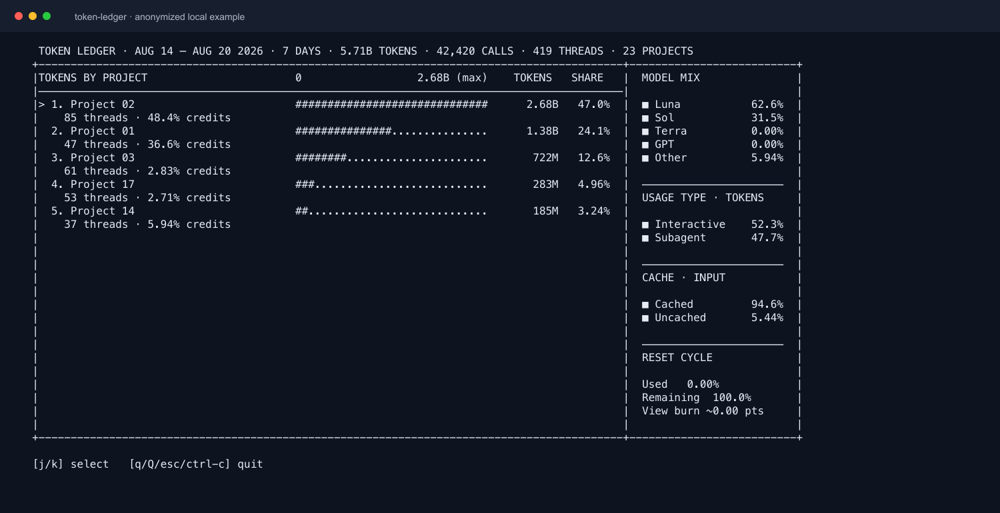

# Token Ledger

Token Ledger is a local-only Codex usage dashboard with two outputs:

- a generated PNG report for trends, model composition, and weekly-meter
  context;
- a terminal dashboard for a fast project and token summary.

This README describes the local checkout. It does not assume a hosted report
or a published npm package.

## Install and use

Requires Node.js 22.13 or newer. From this checkout:

```bash
npm install
npm install -g .
```

The second command links the `tledger` executable on your PATH. Without a
global link, run the examples below as `npx tledger ...` or
`node bin/token-ledger.mjs ...` from this checkout.

Generate the report as a PNG. `report` is the image form of the trend view and
combines usage, weekly-meter pace and runway, period and per-model cache rates,
and top projects. The default file is `token-ledger-report-7d.png` in the
current directory.

```bash
tledger report 7d --no-open
tledger report 7d --cache-rate --no-open
# choose a destination explicitly
tledger report 7d --image-output artifacts/token-ledger-report-7d.png --no-open
```

Use the terminal dashboard for the compact view:

```bash
tledger week
tledger week 2026-08-20 --static
tledger 1d --static
```

`week` covers seven local calendar days ending on the selected day; its upper
boundary is the next local midnight and is end-exclusive. `1d` is a rolling
24-hour view ending when the command starts. In a TTY, the project dashboard
is interactive; `--static` prints once, and `--plain` or `NO_COLOR=1` disables
color. In the interactive view, `j`/`k` select a project; `q`, `Q`, `Esc`, or `Ctrl-C` exits.
Enter does not inspect a project, and `d` / `w` / `m` do not change the range;
choose the range in the command. `trend [Nd|Nw] --image` is equivalent to
`report [Nd|Nw]`.

## Cache and input controls

`tledger report [Nd|Nw] --cache-rate` writes a separate, purpose-built cache
report to `token-ledger-cache-report-<period>.png`. Its primary view is the
input-token-weighted cache rate (`cached input / measured input`), shown
across the selected period with input-volume context. A smaller model breakout
shows which models account for that input and their individual cache rates.
The cache report intentionally omits the general report's project, quota-meter,
runway, and output-token sections. Cached input is clamped to input per event,
and the report states how much token volume had a usable component breakdown.
Use `--image-output`, `--image-width`, `--date`, `--tz`, and `--no-open` the
same way as on the standard report.

The default privacy-reduced snapshot is
`~/.token-ledger/token-ledger-snapshot.json.gz`. It is gzip-compressed, written
atomically with mode `0600`, and capped at 16 MiB after compression. If a
refresh would exceed that limit, Token Ledger preserves the previous cache and
asks you to reduce the source with `--no-archived` or the collector's `--since`
option instead of writing an oversized file. On a normal default-path run, a
snapshot whose mtime is in the past and less than one hour old skips the source
walk. An exact-hour or future mtime is not fresh; an older snapshot is checked
against local source mtimes before it is reused or rebuilt.

```bash
# Force a rebuild from CODEX_HOME or ~/.codex
tledger week --refresh

# Read the existing default snapshot without a source-freshness check
tledger week --no-refresh

# Read an explicit snapshot without automatic freshness checks
tledger week --input /path/to/token-ledger-snapshot.json.gz
```

`--refresh` rebuilds the default snapshot and cannot be combined with
`--input` in this checkout. `--no-archived` excludes `archived_sessions` when a
refresh occurs. The collector can also be run directly:

```bash
node lib/token-ledger-importer.mjs --output /path/to/token-ledger-snapshot.json.gz
```

Explicit `.json` snapshots remain readable for fixtures and deliberate exports,
but `.json.gz` is the bounded production cache format. After an upgrade, the
new cache does not read or delete the legacy `token-ledger-snapshot.json` file;
remove that old generated cache separately once the compressed cache is proven.

## Report versus CLI

| | Generated report | Terminal dashboard |
| --- | --- | --- |
| Command | `tledger report 7d` or `tledger trend 7d --image` | `tledger week`, `tledger 1d`, or `tledger day <date>` |
| Output | One PNG with a stat quad, weekly-meter pace/runway, daily token columns, an aligned cache-rate strip, top projects, and per-model cache rates | Interactive or static project rows with totals, shares, thread counts, model mix, usage type, cache split, and reset-cycle context |
| Range | A selected local-calendar-day trend window, such as 7d or 2w | A calendar day/week or a rolling 24-hour/`Nd`/`Nw` window |
| Estimate surface | Meter-derived burn and runway are called out; cache coverage comes from measured token breakdowns | The sidebar can show derived `View burn`; project detail includes rate-card credit shares when available |

The report is the broader visual summary. The CLI does not open or generate a
report unless you request the `report`, `trend --image`, or `--image` form.

## Examples

### Seven-day report


### Non-report CLI output



The terminal capture was made from a local privacy-reduced snapshot after
replacing project and thread labels with neutral names. It contains no prompts,
responses, secrets, home paths, or project names.

## What is observed

The collector reads local rollout JSONL under `sessions/` and, unless disabled,
`archived_sessions/`, plus `session_index.jsonl` and read-only `state_5.sqlite`
metadata. It retains positive `last_token_usage` model-call events and their
timestamps, turn IDs, model/source attribution, and token categories.

Observed totals are the sum of globally de-duplicated retained events. Events
with turn IDs use the turn plus cumulative/last-usage/context signatures;
legacy events without turn IDs use a high-specificity usage signature and are
marked as heuristic. State database token counters are kept as non-additive
reference values because forks and subagents inherit cumulative history.

Input, cached-input, output, and reasoning are stored as separate categories:
cached input is a subset of input, and reasoning is a subset of output. Any
composition that presents them together subtracts those subsets to avoid
double counting. Models are attributed from turn context/settings and local
thread metadata, then normalized for display.

The weekly meter uses local rate-limit observations for the account-wide
weekly window. Reset timestamps identify windows; stale readings and separate
named pools are not stitched into that meter. Remaining percentage,
observation time, and the selected window are local observations; the reset
type (weekly expiry versus restart) is derived by comparing the prior window's
reset timestamp with the first reading of the new window. None of this is an
official account-wide quota or billing record.

The exported snapshot contains token metadata, model/use-type labels, project
labels, and display titles. It omits message bodies, reasoning text, tool
arguments/results, credential fields, and full local paths. Display titles and
project labels are user-written or local metadata and should be reviewed before
sharing. Normal successful dashboard output is privacy-reduced, but diagnostics
or explicit PNG writes may echo configured snapshot, Codex, or output path
labels.

## What is estimated

Credit values use the hardcoded rate card dated **2026-08-17**. Cached input is
priced separately, priority/fast-mode events use the 1.5× multiplier, and
events without a detailed breakdown or known model rate are unrated. These are
rate-card estimates, not provider billing totals.

When meter observations are available, report bars in `--drain` mode represent
observed meter drops; model attribution within a drop uses rate-card weights
when possible and token weights as a fallback. Long observation gaps are
spread across local calendar days as estimates. Tokens-per-meter-point,
model-split burn, runway, and CLI `View burn` are derived estimates. None is
official billing, quota, or account-completeness truth.

## Verify

```bash
npm test
npm run lint
npm run verify:release
npm pack --dry-run --json
```
