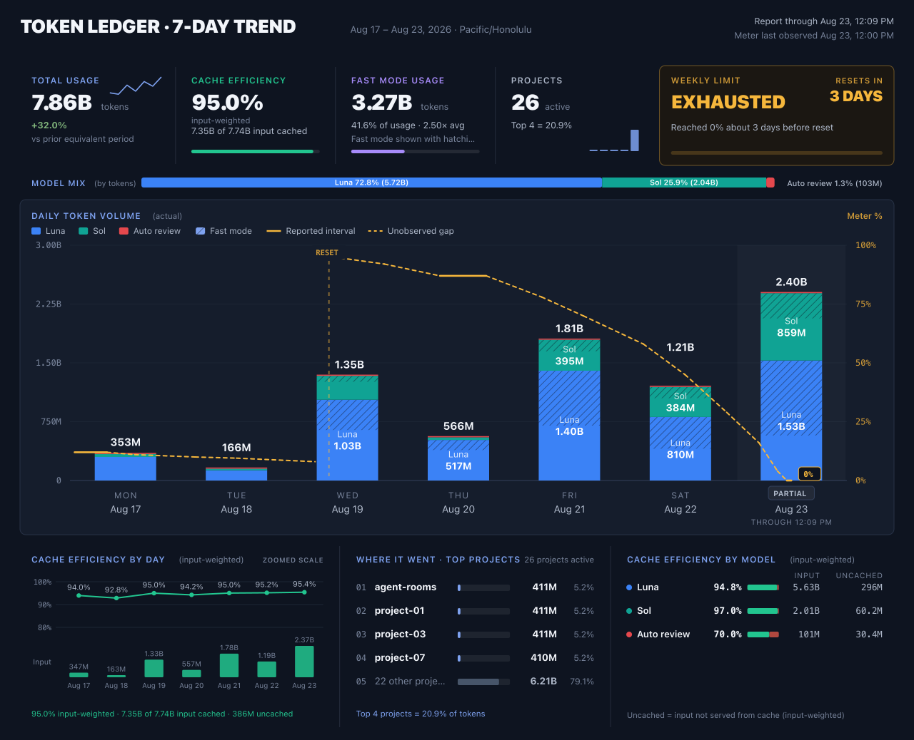

# Token Ledger

Token Ledger is a small, local-only terminal dashboard for Codex usage. It
shows ranked project bars, model mix, usage type, cache coverage, and reset
cycle context without sending your data anywhere.

## Install

Requires Node.js 22.13 or newer.

Once published, install the CLI with:

```bash
npm install -g tledger
```

For a one-time run without a permanent global install:

```bash
npx tledger week
```

Until the package is published, install it from this repository:

```bash
git clone <repository-url>
cd token-ledger
npm install -g .
```

The package uses a small runtime image encoder for PNG report output, Node's
built-in SQLite support, and reads Codex data directly from the local machine.

## Run

The shortest useful command is:

```bash
tledger week
```

It defaults to today's seven-day window, the computer's local timezone, the
top 10 projects, and the local Codex data directory. The default terminal view
is interactive; press `q` or `esc` to exit.

Other common views:

```bash
tledger 1d
tledger 1d --static
tledger 2d
tledger 1w
tledger 3w --static
tledger day 2026-08-05
tledger week --top 5
tledger week --static
tledger trend 7d --static
tledger trend 7d --image --image-output artifacts/token-ledger-trend-7d.png
tledger report 7d
```

Bare duration aliases such as `tledger 1d`, `tledger 2d`, `tledger 3d`,
`tledger 1w`, `tledger 2w`, and `tledger 3w` show the `TOKENS BY PROJECT`
breakdown for a rolling window ending when the command starts. Day and week
aliases accept any positive `Nd` or `Nw` value up to 3,650 days. `tledger 1d`
is the existing rolling 24-hour view; `tledger 1w` is a rolling seven-day
window. This is different from `tledger day today`, which covers the current
calendar day from local midnight, and `tledger week`, which covers seven local
calendar days.

`tledger report [Nd|Nw]` is the one-step report output: it writes the
dashboard PNG (identical to `trend --image`) to
`token-ledger-report-<period>.png` in the current directory. It accepts the
same flags as the trend view (`--drain`, `--date`, `--tz`, `--image-output`,
`--image-width`) and prints progress while rendering and encoding the image.

The terminal trend view is a compact approximation of the image view. For the
full chart grammar, use `--image`: it writes a single shareable report card as
a PNG. The report leads with a total-usage KPI (with a delta against the prior
equivalent period), input-weighted cache efficiency, the fast-mode share of
actual tokens, and the active-project count, beside the latest observed
weekly-limit state. Below that sit a model-mix strip, calendar-day columns of
local token volume stacked by model, daily cache efficiency with input
volumes, top projects, and a per-model cache table.



The weekly-limit line is drawn from sampled OpenAI observations, never
continuous telemetry: solid runs mark spans confirmed by repeated equal
readings, dashed runs bridge unobserved gaps, and the line never extends past
the latest reading. When the report is generated partway
through the final day, that column is marked `PARTIAL` with the actual cutoff
time, and the prior-period delta compares an equally long partial window.
Values allocated from compacted history are marked with `≈`; unmarked values
come from exact event data. Reports built from an explicit or stale snapshot
say `Snapshot generated …` (with a `STALE` badge on fallback) instead of
claiming to be current. Compact warning chips appear only when the report has
unparsed source records, incomplete token-component coverage, external or
non-current input, estimated history, or a snapshot/current rate-card
mismatch.

When run from a terminal, the finished PNG opens in the default image viewer
automatically so the report lands on screen instead of in a file browser.
Pass `--no-open` to skip that; piped or scripted runs never open a window.

Turns run in fast mode (service tiers "priority" and "fast") are drawn with a
diagonal hatch inside their model's segment — fast mode is a property of usage,
not a separate model, so the hatch never adds bar height and stays legible in
grayscale.

Pass `--drain` to flip the columns into limit-drain units instead: each column
becomes the weekly limit percentage the meter dropped, stacked by model using
rate-card credit weights (an estimate — the official card is the best
available proxy for per-model debit, but subscription limits are not billed
per token), on the same percent scale as the meter line.

Meter windows are keyed by their server-reported reset timestamp, so a fresh
window that starts days early (a provider-initiated limit restart) is drawn as
its own cycle and labeled `restart`, while a true weekly expiry is labeled
`reset`.
Stale readings from sessions still reporting a superseded window are dropped
instead of being fused into the line as phantom drain. Drops observed after a
sparse meter gap (over 36 hours) are spread across the covered days and marked
with `≈`. When a range has no usable meter drain, columns fall back to raw
local token counts and the chart says so.

`--image` defaults to `token-ledger-trend-7d.png` in the current directory.
Use `--image-output <file.png>` to choose the path and `--image-width <px>` to
choose a width from 900 to 2400 pixels.

Use `trend 14d` for daily columns across two weeks. At 30 days, the terminal
uses readable multi-day bins: three-day bins at ordinary widths and two-day
bins on wider terminals. The image view keeps daily columns while they stay
legible and falls back to the same readable multi-day binning for longer
windows. Meter-drain weighting uses the rate card bundled with this release;
subscription limits are not billed per token.

The CLI checks the local Codex source manifest on every automatic load. If it
differs from the cached watermark, the CLI rebuilds the privacy-reduced
snapshot; otherwise it reuses the cache immediately. The first refresh may
scan historical rollout files. The one-hour threshold affects only the
displayed freshness label, not source validation. Use `--refresh` to force a
rebuild even when the manifest is unchanged.

The `1d` project dashboard shows a compact snapshot-age line such as
`SNAPSHOT · fresh · 12m old`. `fresh` means the snapshot is within the
one-hour cache window, `stale` means it is older, and `age unknown` means the
snapshot has no usable capture-time metadata. The indicator does not print a
local path or trigger another source scan.

Useful overrides:

```bash
# Use another timezone instead of the computer's local timezone
tledger week --tz America/New_York

# Force a complete local refresh
tledger week --refresh

# Skip the freshness check and use the existing cache
tledger week --no-refresh

# Read a specific privacy-reduced snapshot
tledger week --input /path/to/token-ledger-snapshot.json
```

`--static` prints once for pipes, logs, or terminals without interactive input.
`--plain` or `NO_COLOR=1` disables ANSI color. `--youplot` is an optional
legacy renderer and is not required for the default dashboard.

## Local data and privacy

The CLI reads from `CODEX_HOME` when set, otherwise `~/.codex`. It uses local
Codex rollout JSONL files, the session index, and local state metadata. It
writes a replaceable, privacy-reduced report snapshot to:

```text
~/.token-ledger/token-ledger-snapshot-v3.json.gz
```

It also maintains the durable local ledger separately at:

```text
~/.token-ledger/token-ledger-ledger.sqlite
```

The ledger is the append-and-deduplicate source of truth for committed token
events, quota samples, source state, and useful thread metadata. The snapshot
is a generated export and can be replaced or rebuilt without deleting ledger
history. Refreshes scan both `sessions` and `archived_sessions`; a source that
is removed is recorded as missing or tombstoned, and its committed observations
remain available. A file replacement or truncation is recorded as a mutable
source change and does not re-add earlier observations.

Exact observations are retained for 3,650 days. Older observations are
compacted into UTC daily buckets with additive totals and source membership;
the supported report window is never silently compacted away. Existing v3
snapshots are migrated once, when readable, into explicitly marked
`migrated_compacted` rows. Those rows preserve totals and ranges but do not
invent exact event or turn identities, and remain marked as estimated in
coverage. A missing legacy snapshot is also recorded as checked so a later
refresh cannot unexpectedly migrate a different file into the same ledger.
An existing malformed, unreadable, oversized, non-regular, or non-v3 snapshot
instead stops with `ERR_DURABLE_LEDGER_LEGACY_SNAPSHOT` before the ledger
revision advances. Its bytes and the one-shot migration opportunity are
preserved so the snapshot can be privately backed up, repaired or replaced,
and retried.

Compacted rows are retained for 7,300 days (20 years) before retirement.
Source, quota, tool, and state-only thread metadata are pruned only after they
are outside the applicable retention horizon; the supported report window is
never silently dropped.
Compacted usage buckets retain their deduplicated source-association scope, so
`--no-archived` can exclude archived-only history without including it through
an aggregate that also contains active usage.

Legacy snapshot history is imported only when its collection scope and hashed
Codex-home identity are both provable. If either check fails, exact rollout
collection continues without that legacy history and reports show a compact
`LEGACY HISTORY SKIPPED` warning. The reason is also recorded as
`coverage.legacySnapshotStatus` in the generated snapshot.

The default snapshot and ledger directories are private (`0700`), and their
files are private (`0600`). An explicit `--input` reads only that deliberate
snapshot input; it does not use the default durable ledger as a hidden source.
When a custom output or ledger location is supplied, existing parent directory
permissions are left unchanged; only the ledger sidecar files receive `0600`.

The collector does not export message bodies, reasoning text, tool arguments or
results, credentials, file contents, or full local paths. Display titles may
contain user-written text. CLI errors and empty-state source labels show only a
safe filename label, not an absolute input or source path. When a PNG or report
is written, the explicit output path is reported so you can find the file. The
CLI makes no network requests.

For schema health signals, non-destructive recovery guidance, cache/ledger
coherence, and the repeatable scaling benchmark, see
[Durable ledger operations](docs/durable-ledger-operations.md).

## Keyboard controls

In the interactive dashboard:

- `↑` / `↓` or `j` / `k` moves between projects.
- `q`, `Q`, `Esc`, or `Ctrl-C` exits.
- Enter does not inspect a project, and `d` / `w` / `m` do not
  change the range; choose the desired range in the command instead.

## Verify from source

```bash
npm test
npm run lint
npm run verify:release
npm pack --dry-run --json
```

`npm run verify:release` packs the allowlisted artifact, installs that tarball
in a clean temporary directory with no network or Codex data access, and runs
the installed `tledger --help` and synthetic `tledger 1d --static` smoke checks.
